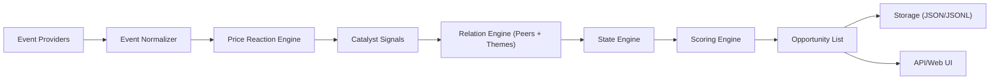

# Intelligence System Design

> **Status: Needs review.** Validate implementation status and pipeline details.  
> **Last Reviewed:** February 17, 2026.

## Scope

This document defines the technical architecture for the Market Intelligence Layer.

Primary goal:

- detect fresh market attention
- validate attention through price reaction
- merge catalyst quality with technical readiness
- publish a short, explainable focus list

Non-goals:

- automated execution
- intraday event-driven trading
- predictive modeling

## Design Constraints

- Post-close batch operation
- Deterministic scoring and transitions
- File-based state persistence
- Bounded candidate output (5-8 per day)
- Explainable component scores

## Module Layout

Planned package:

`/src/swing_screener/intelligence/`

Core modules:

- `config.py`: typed intelligence config and defaults.
- `models.py`: dataclasses for events, catalyst signals, theme clusters, symbol state.
- `ingestion/`: source adapters (news, calendars).
- `reaction.py`: abnormal move detection and false-catalyst filter.
- `relations.py`: peer map and theme cluster detection.
- `state.py`: symbol lifecycle transition engine.
- `scoring.py`: catalyst and opportunity scoring.
- `storage.py`: read/write persistence for snapshots and state.
- `pipeline.py`: orchestration entrypoint used by API/CLI.

## Data Flow

## Data Contracts (V1)

### Event

- `event_id: str`
- `symbol: str`
- `source: str`
- `occurred_at: str`
- `headline: str`
- `url: str | None`
- `event_type: str`
- `credibility: float` (`0..1`)

### CatalystSignal

- `symbol: str`
- `event_id: str`
- `return_z: float`
- `atr_shock: float`
- `peer_confirmation_count: int`
- `recency_hours: float`
- `is_false_catalyst: bool`

### ThemeCluster

- `theme_id: str`
- `name: str`
- `symbols: list[str]`
- `cluster_strength: float` (`0..1`)
- `driver_signals: list[str]`

### SymbolState

- `symbol: str`
- `state: QUIET|WATCH|CATALYST_ACTIVE|TRENDING|COOLING_OFF`
- `last_transition_at: str`
- `state_score: float`
- `last_event_id: str | None`

### Opportunity

- `symbol: str`
- `technical_readiness: float` (`0..1`)
- `catalyst_strength: float` (`0..1`)
- `opportunity_score: float` (`0..1`)
- `state: str`
- `explanations: list[str]`

## Scoring Pipeline

### 1. False-Catalyst Gate

Default rule:

- keep signal only if `return_z >= 1.5`

Optional additional checks:

- `atr_shock >= min_price_reaction_atr`
- min liquidity/tradability filters

### 2. Catalyst Strength

Weighted components:

- event credibility
- reaction magnitude
- recency decay
- peer confirmation
- theme confirmation

All component weights are config-driven and persisted in output metadata.

### 3. Opportunity Score

Default blend:

`opportunity = 0.55 * technical + 0.45 * catalyst`

Output is sorted descending and hard-capped by `max_daily_opportunities`.

## State Machine

Transitions are deterministic and threshold-based.

- `QUIET -> WATCH`: abnormal event or reaction appears.
- `WATCH -> CATALYST_ACTIVE`: catalyst passes false-catalyst gate.
- `CATALYST_ACTIVE -> TRENDING`: follow-through days and stable structure.
- `TRENDING -> COOLING_OFF`: weakening momentum/attention.
- `COOLING_OFF -> QUIET`: state expiry or normalization.

State transitions are persisted daily for auditability.

## Persistence Layout

Files under:

`/data/intelligence/`

V1 storage:

- `events_YYYY-MM-DD.jsonl`
- `signals_YYYY-MM-DD.json`
- `themes_YYYY-MM-DD.json`
- `opportunities_YYYY-MM-DD.json`
- `symbol_state.json`

All file writes are append-or-replace deterministic snapshots per day.

## API Integration Plan (V1)

Read-only endpoints:

- `GET /api/intelligence/opportunities?date=...`
- `GET /api/intelligence/symbol/{ticker}`
- `GET /api/intelligence/themes?date=...`

Operational endpoints:

- `POST /api/intelligence/run` (post-close batch trigger)
- `GET /api/intelligence/run/{job_id}` (background job status)

The pipeline runs asynchronously and never blocks screener rendering.

## Config Contract (V1)

Strategy field:

- `market_intelligence`

Top-level keys:

- `enabled`
- `providers`
- `universe_scope`
- `market_context_symbols`
- `catalyst`
- `theme`
- `opportunity`

Reference defaults are implemented in:

`/src/swing_screener/intelligence/config.py`

## Testing Strategy

Unit tests:

- config parsing and defaults
- scoring monotonicity/bounds
- state transition table
- reaction filter thresholds

Integration tests:

- end-to-end pipeline on deterministic fixtures
- API contract tests for run/status/opportunity endpoints

Regression tests:

- output cap enforcement
- stable sorting with tied scores
- missing/empty provider payload handling

## Delivery Plan

1. Phase 0: docs + config contract + tests.
2. Phase 1: models + storage.
3. Phase 2: event ingestion.
4. Phase 3: reaction engine.
5. Phase 4: relation/theme engine.
6. Phase 5: state machine.
7. Phase 6: scoring merge and cap.
8. Phase 7: API + UI integration.

## References

- [Market Intelligence Philosophy](MARKET_INTELLIGENCE_PHILOSOPHY.md)
- [Web UI Guide](WEB_UI_GUIDE.md)
- [Operational Guide](OPERATIONAL_GUIDE.md)
