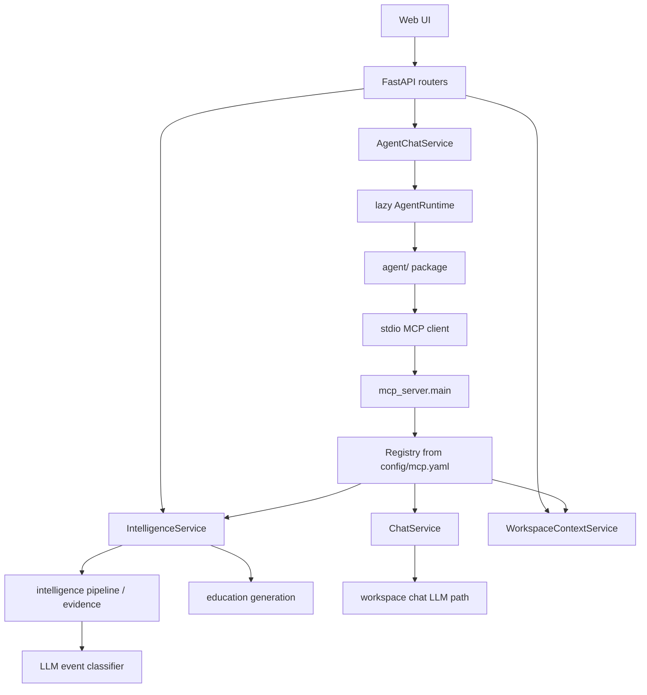

# AI Runtime Architecture

This document describes the canonical AI/LLM runtime paths in the project after the MCP-first cleanup.

## Canonical Paths

## Runtime Rules

- Web UI remains API-first at the HTTP boundary, but workspace chat now routes through a persistent self-healing agent MCP runtime behind `/api/chat/answer`.
- Agent tooling is MCP-first. `agent/client.py` launches the local MCP server over stdio and discovers tools from the live registry.
- MCP tool contracts are single-source now. The server no longer accepts legacy alias parameters that only existed for the old direct adapter path.
- The API-side runtime retries one read-only chat request once after an MCP/session failure by restarting the cached agent.
- Shared business logic stays in services:
  - `api/services/chat_service.py`
  - `api/services/workspace_context_service.py`
  - `api/services/intelligence_service.py`
- Transport layers stay thin:
  - FastAPI routers validate HTTP payloads and forward to services.
  - MCP tools validate MCP arguments and forward to the same services.

## Prompt Surfaces

- Workspace chat uses hardcoded prompts in `ChatService`. The Intelligence config UI does not control workspace chat prompts.
- Intelligence `llm.system_prompt` and `llm.user_prompt_template` control the event-classification pipeline.
- Education views use:
  - `education_{view}_system_prompt`
  - `education_{view}_user_prompt_template`

## Supported User-Facing AI Surfaces

- Workspace chat:
  - Web UI -> `/api/chat/answer` -> `AgentChatService` -> persistent agent runtime -> MCP `chat_answer`
  - Agent -> MCP `chat_answer`
- Runtime observability:
  - `/health` includes `checks.agent_runtime`
  - `/metrics` includes `agent_runtime_running` and `agent_runtime_restart_total`
- Intelligence pipeline:
  - `/api/intelligence/run`
  - `/api/intelligence/opportunities`
  - `/api/intelligence/events`
  - `/api/intelligence/upcoming-catalysts`
  - `/api/intelligence/sources/health`
  - `/api/intelligence/metrics`
- Education:
  - `/api/intelligence/education/generate`
  - `/api/intelligence/education/{symbol}`

## Removed Or Consolidated Paths

- `WorkspaceChatPanel` was removed; the workspace uses `FloatingChatWidget`.
- `TradeThesisPanel` was removed as unused runtime UI.
- `/api/intelligence/explain-symbol` was removed in favor of the education API.
- `/api/intelligence/classify` was removed as an unused duplicate of the internal classification pipeline.
