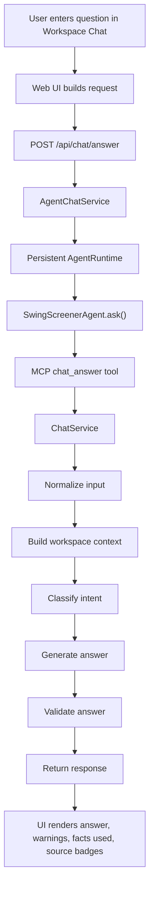

# Workspace Chat Analysis

This document explains how the read-only workspace chat works in Swing Screener:

- what data it receives
- how backend context is assembled
- what prompt shape is sent to the model
- what guardrails and fallbacks exist
- how the `/agent` wrapper relates to the same flow

## Scope

This covers the user-facing workspace chat and the shared MCP chat tool:

- Web UI path: `web-ui/src/components/domain/workspace/FloatingChatWidget.tsx`
- API path: `api/routers/chat.py` -> `api/services/agent_chat_service.py`
- MCP path: `mcp_server/tools/intelligence/chat_answer.py`
- Agent wrapper: `agent/chat_graph.py`

The important implementation detail is that there is one real chat engine:

- `ChatService`

The API, agent, and MCP layers now forward requests into that service through the same agent+MCP path, and the API side keeps a persistent backend agent runtime instead of starting a fresh one for each request.
That runtime is self-healing for the chat path: if one MCP-backed `ask()` call fails, it discards the cached agent, starts a fresh one, and retries the read-only request once.

## High-Level Flow



The same runtime also exposes lightweight operational state through the API:

- `/health` includes `checks.agent_runtime`
- `/metrics` includes `agent_runtime_running`
- `/metrics` includes `agent_runtime_restart_total`

## Request Data From The UI

The web UI sends a `ChatAnswerRequest` with:

- `question`
- `conversation`
- `selected_ticker`
- `workspace_snapshot`

### `conversation`

Each turn contains:

- `role`: `user` or `assistant`
- `content`
- optional timestamp

The request model allows up to 20 turns, but the service trims that to the last 10 before using it.

### `workspace_snapshot`

This is a compact snapshot of the latest screener state from the UI. It can include:

- snapshot date and freshness
- total screened count
- a list of candidates

Each candidate can include:

- ticker, name, sector, rank
- score, confidence, signal
- close, entry, stop, target, reward/risk
- recommendation verdict and short reasons
- beginner explanation
- same-symbol context such as add-on mode and stop differences

This snapshot is built from the latest screener result in the frontend, not fetched separately by the chat service.

## Backend Context Assembly

`WorkspaceContextService` enriches the incoming request with stored local state and cached intelligence data.

It loads:

- portfolio orders
- portfolio positions
- computed portfolio summary
- selected screener candidate from the incoming workspace snapshot
- latest cached intelligence opportunities
- latest cached intelligence events
- cached education output for the selected ticker

It also produces:

- `warnings`
- `meta.sources`
- `fact_map`

### Source Metadata

The response exposes which sources were available:

- `portfolio`
- `screener`
- `intelligence`
- `education`

Each source records:

- label
- `loaded`
- origin
- `asof`
- count

This is what the UI shows as source badges.

### Fact Map

The `fact_map` is the key normalization layer. It converts the current workspace state into compact, explicit facts the model is expected to rely on.

Examples:

- `portfolio.orders.pending_count`
- `portfolio.summary.total_pnl`
- `portfolio.selected_position.pnl`
- `screener.snapshot.top_candidates`
- `screener.selected_candidate.entry`
- `screener.selected_candidate.same_symbol.mode`
- `intelligence.selected_opportunity.state`
- `intelligence.selected_events.latest`
- `intelligence.selected_education.thesis_summary`

This is the most important thing the chat service gives the model. The prompt explicitly tells the model to use these facts and the validator checks whether the returned `facts_used` keys exist in the assembled context.

## ChatService Graph

`ChatService` is implemented as a small LangGraph workflow:

1. `normalize_input`
2. `build_context`
3. `classify_intent`
4. `answer_question`
5. `validate_answer`
6. `return_response`

### 1. Normalize Input

The service:

- trims and normalizes the question text
- keeps only the last 10 conversation turns
- starts with an empty warnings list

### 2. Build Context

The service calls `WorkspaceContextService.build_context(...)` using:

- `selected_ticker`
- `workspace_snapshot`

### 3. Classify Intent

The service routes the question into one of these intents:

- `portfolio`
- `screener`
- `intelligence`
- `selected_ticker`
- `forecast`
- `general`
- `action_request`

If an LLM is enabled, classification is done with a strict JSON prompt. If not, heuristic keyword routing is used.

### 4. Generate Answer

There are three answer modes:

- read-only guardrail response for action requests
- LLM-generated structured answer
- deterministic fallback answer

### 5. Validate Answer

The validator:

- normalizes the answer text
- filters `facts_used` to valid fact keys
- blocks action requests again
- rejects empty output
- rejects speculative language
- falls back to deterministic logic when needed

Speculative markers currently include words like:

- `could`
- `might`
- `likely`
- `probably`
- `expected`
- `may`

### 6. Return Response

The API returns:

- `answer`
- `warnings`
- `facts_used`
- `context_meta`
- `conversation_state`

The returned conversation is the last turns plus the new user question and assistant answer, capped at 12 turns.

## Prompt Shape

The workspace chat path does not use a natural-language templating system for the actual answer prompt.

Instead, it sends:

- one `SystemMessage`
- one `HumanMessage` containing JSON

The JSON includes:

- `format_instructions`
- `payload`

That means the model receives a structured machine-readable prompt, not a free-form user prompt template.

## Intent Classification Prompt

When LLM intent classification is enabled, the system prompt is effectively:

- classify read-only workspace chat questions
- return strict JSON
- use `forecast` for future-oriented upside/downside questions
- use `action_request` for anything that tries to mutate state

The classifier payload contains:

- `question`
- `selected_ticker`
- `available_sources`

## Answer Generation Prompt

### Default Answer Prompt

The standard system prompt tells the model to:

- act as a read-only workspace assistant for a swing-trading system
- use only provided context and facts
- never invent fresh data
- never invent predictions or guarantees
- say plainly when context is missing
- return strict JSON only

### Forecast Prompt

Forecast-like questions do not get a real forecasting prompt. They get a scenario-analysis prompt.

The forecast system prompt tells the model to:

- provide bounded forward-looking scenario analysis only
- use only provided context and facts
- not claim to foresee or predict prices
- avoid words such as `may`, `might`, `could`, `likely`, `probably`, `expected`
- write compact scenario analysis
- include base case, bull case, and bear case
- state clearly that the output is scenario analysis, not a forecast
- return strict JSON only

## Answer Payload Sent To The Model

The answer-generation payload has this shape:

```json
{
  "question": "user question",
  "intent": "portfolio|screener|intelligence|selected_ticker|forecast|general|action_request",
  "conversation": [
    {"role": "user", "content": "..."},
    {"role": "assistant", "content": "..."}
  ],
  "context_summary": {
    "selected_ticker": "AAPL",
    "warnings": ["..."],
    "portfolio": {
      "orders_count": 1,
      "positions_count": 2,
      "portfolio_summary": {}
    },
    "screener": {
      "snapshot": {},
      "selected_candidate": {}
    },
    "intelligence": {
      "selected_opportunity": {},
      "latest_event": {},
      "education_thesis": {}
    },
    "facts": {
      "portfolio.orders.pending_count": "1",
      "screener.selected_candidate.entry": "102.00"
    }
  },
  "facts": {
    "portfolio.orders.pending_count": "1",
    "screener.selected_candidate.entry": "102.00"
  },
  "rules": {
    "read_only": true,
    "must_reference_fact_keys": true,
    "scenario_only": false,
    "max_warnings": 4
  }
}
```

The expected response schema is structured JSON:

```json
{
  "answer": "string",
  "facts_used": ["fact.key"],
  "warnings": ["warning"]
}
```

## Guardrails

### Read-Only Enforcement

If the user asks to do something like:

- create an order
- place an order
- buy or sell
- update a stop
- close a position
- run intelligence
- cancel an order

the service does not execute anything. It returns a fixed read-only explanation.

### Anti-Speculation Enforcement

Even if the LLM returns an answer successfully, the service replaces it if the text appears speculative.

This matters because the product position is:

- explain the current workspace
- allow scenario framing
- do not claim predictive certainty

### Fact-Key Enforcement

The model can return `facts_used`, but the service only keeps fact keys that actually exist in `context.fact_map`.

If none survive validation, it injects default fact keys for the detected intent when possible.

## Deterministic Fallback Answers

If the LLM is disabled, unavailable, fails, or produces speculative output, the service falls back to handwritten answer logic.

There are deterministic answer branches for:

- portfolio questions
- screener and selected-ticker questions
- intelligence questions
- forecast-style scenario answers
- general workspace summaries

This means workspace chat is not fully dependent on a live model.

## Important Configuration Detail

The intelligence config model exposes:

- `llm.system_prompt`
- `llm.user_prompt_template`

However, this workspace chat path does not currently use those fields for the chat answer prompt.

For workspace chat, the service uses config for:

- provider
- model
- base URL
- API key
- enabled flag

But the actual chat prompt text is hardcoded in `ChatService`.

This is important because the UI may suggest prompt configurability that does not actually affect this chat path.

## LLM Provider Layer

The shared chat model factory supports:

- `openai`
- `ollama`
- `mock`

For workspace chat:

- `mock` is treated as not LLM-ready
- `openai` requires an API key
- `ollama` uses the configured local host

Chat inference is created with:

- temperature `0`
- max retries `0`

That choice is consistent with the product goal of stable, bounded, fact-grounded answers.

## Agent And MCP Relationship

There is an `agent` package, but for chat it does not define a different reasoning system.

The flow is:

- persistent `AgentRuntime`
- `SwingScreenerAgent.ask(...)`
- `AgentChatGraph.ask(...)`
- MCP tool `chat_answer`
- shared `ChatService.answer(...)`

So the agent wrapper is a transport layer around the same workspace chat engine, and the API path now reuses that same transport instead of bypassing it.

## Practical Summary

The workspace chat is best understood as:

- a read-only Q and A layer over current workspace state
- backed by local portfolio data, UI screener snapshot data, and cached intelligence
- normalized through an explicit fact map
- optionally LLM-assisted for intent classification and answer drafting
- heavily constrained by validation and fallback logic

It is not a free-form autonomous agent and it is not using a long hidden conversational prompt stack. The real control surface is the assembled structured context plus the hardcoded system prompts in `ChatService`.

## Primary Code References

- `web-ui/src/components/domain/workspace/FloatingChatWidget.tsx`
- `web-ui/src/features/chat/types.ts`
- `api/models/chat.py`
- `api/routers/chat.py`
- `api/services/agent_chat_service.py`
- `api/services/agent_runtime.py`
- `api/services/chat_service.py`
- `api/services/workspace_context_service.py`
- `mcp_server/tools/intelligence/chat_answer.py`
- `agent/chat_graph.py`
- `src/swing_screener/intelligence/llm/factory.py`
