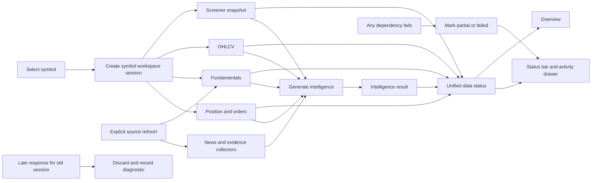
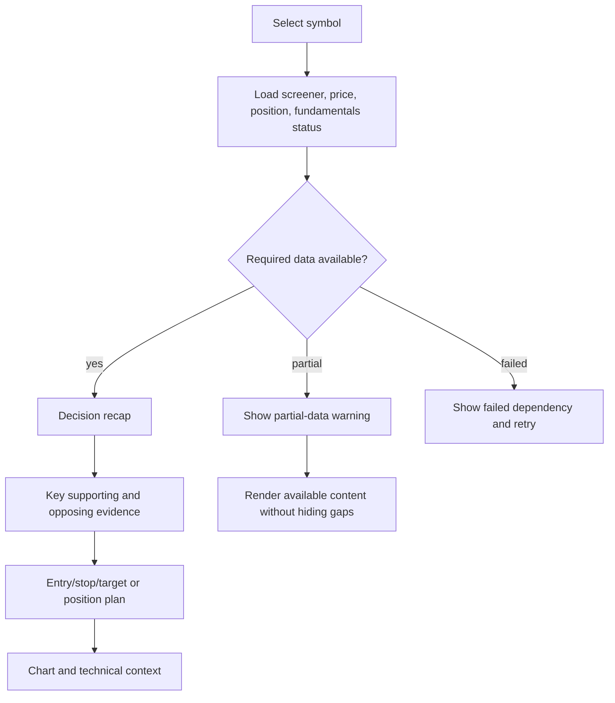
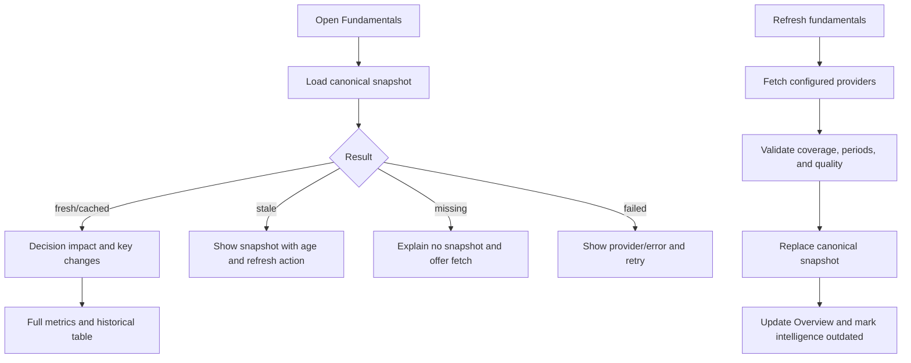
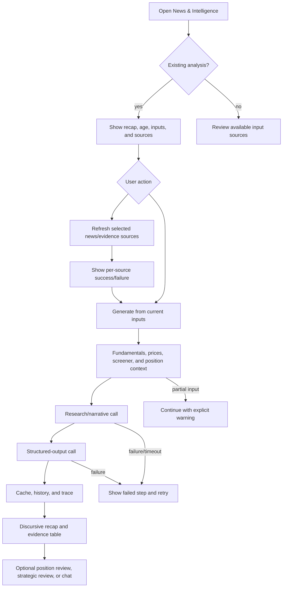
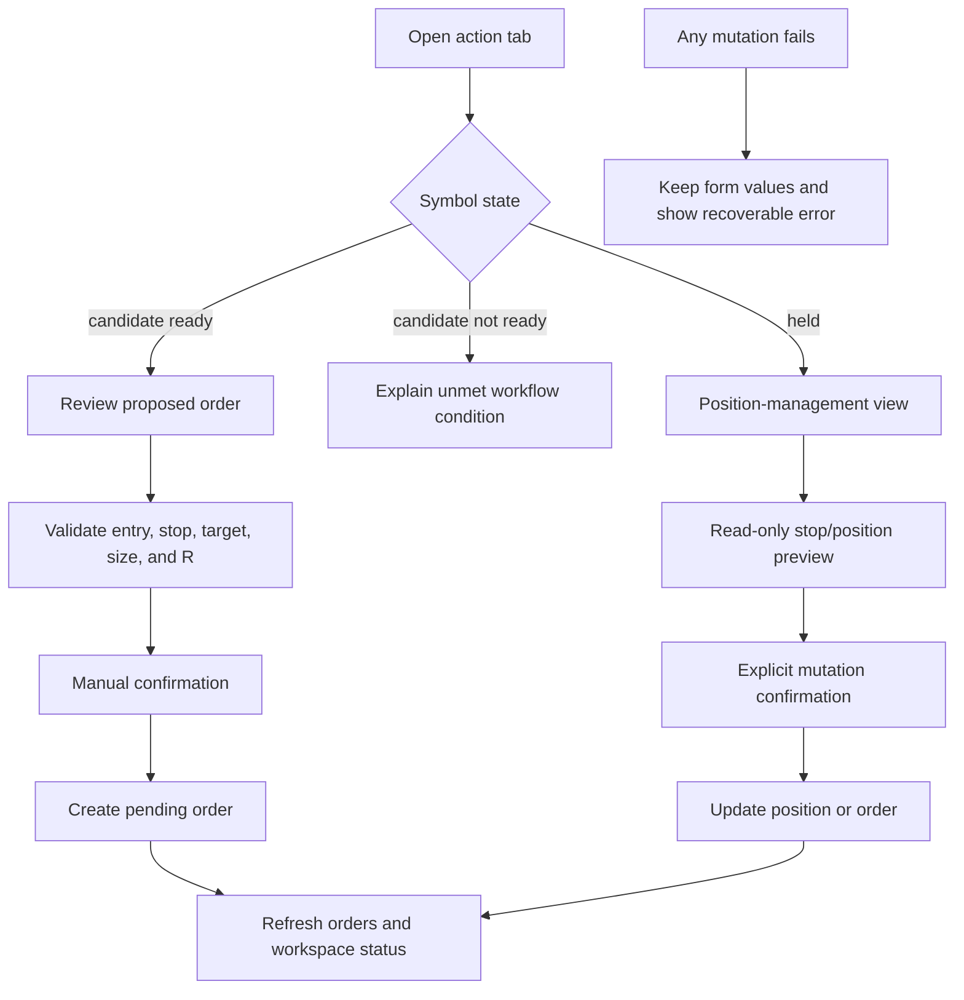
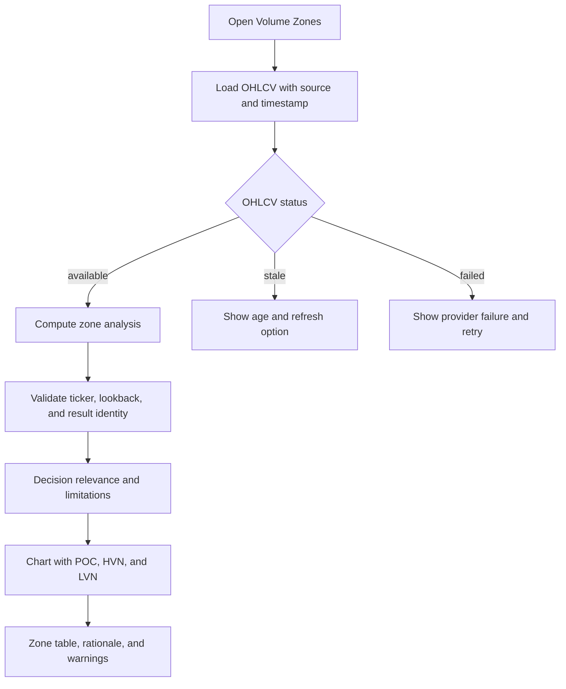

# Symbol Workspace Redesign

**Date:** 2026-07-27

**Status:** Approved design

**Scope:** Today-page symbol analysis workspace, excluding Backtest behavior

## Problem

The Today page opens symbol details in a canvas that is too narrow for the
amount and complexity of information it contains. The canvas also combines
separately cached screener, market-data, fundamentals, intelligence, position,
and order state without making their different timestamps or refresh behavior
clear.

The current UI contains useful information, but its hierarchy is inconsistent:

- The decision is repeated across several cards.
- Fundamentals presents a large metric inventory before establishing its
  relevance to the trade.
- Intelligence exposes generated analysis, source refresh, position review,
  strategic review, chat, and traces without a clear sequence.
- A new screener run can coexist with older fundamentals or intelligence while
  the UI appears to describe a single snapshot.
- Fail-soft backend enrichment can produce a successful intelligence result
  with missing inputs, but the UI does not consistently disclose the degraded
  sources.
- Loading indicators are local to individual controls, so a failed or
  unfinished background request can disappear from view.

## Goals

1. Give the selected symbol enough room without losing the user's table context.
2. Present information in decision order: answer, evidence, trust, then detail.
3. Make every dataset's source, timestamp, cache state, and failures visible.
4. Make intelligence generation a deliberate, understandable sequence.
5. Prevent stale, cross-symbol, or late responses from being presented as
   current.
6. Preserve manual execution and read-only preview boundaries.
7. Define deterministic tests for normal, stale, partial, failed, and racing
   request states.

## Non-goals

- Changing Backtest behavior or redesigning the Backtest tab.
- Changing trading rules, ranking, R-multiple calculations, or workflow
  precedence.
- Adding intraday signals, automatic execution, broker integrations, or
  heuristic freshness rules.
- Automatically running paid or external intelligence calls when a symbol is
  selected.
- Hiding missing data by synthesizing replacement values.

## Chosen approach

Use an expandable symbol workspace. Selecting a symbol collapses the Today
table into a narrow symbol rail and expands the canvas across the available
page width. An optional full-screen control provides additional room. This
preserves the user's table filters, sorting, scroll position, source tab, and
selection while giving the research surface a stable layout.

A fully replacing symbol page would provide more space but make comparison and
return-to-list behavior slower. A resizable split view would retain flexibility
but keep the cramped layout as an easy failure mode and add unnecessary layout
state.

## Information hierarchy

Every tab follows the same four layers:

1. **Answer:** What does this mean for the trade?
2. **Evidence:** Which facts support or oppose that answer?
3. **Trust:** Which source produced the facts, when, with what completeness?
4. **Detail:** Full metrics, history, raw evidence, and traces on demand.

The UI must not repeat the same decision in multiple equally prominent cards.
The canonical screener decision remains authoritative. Intelligence is labeled
as advisory context or a second opinion and never silently replaces the
canonical action.

## Workspace layout

### Collapsed symbol rail

When a symbol is selected, the left table becomes a narrow rail that shows:

- ticker;
- workflow status;
- selection state;
- enough nearby symbols to switch context.

The expanded workspace must retain the table's filters, sorting, scroll
position, and Today/Last Run/Watchlist source tab. Closing the workspace restores
the table without resetting those values.

### Sticky workspace header

The sticky header contains:

- ticker and company name when available;
- candidate, held-position, or ad-hoc mode;
- screener run time and final-close/intraday label;
- aggregate data health: `fresh`, `mixed`, `stale`, `partial`, or `failed`;
- explicit **Refresh all data** action with progress;
- collapse, full-screen, and close controls.

**Refresh all data** refreshes the in-scope non-paid sources. It does not
automatically generate or force-refresh LLM intelligence. The intelligence
section must describe when its existing result became outdated and offer a
separate explicit generation action.

### Data status bar

The status bar shows one item for each relevant domain:

- screener decision;
- prices/OHLCV;
- fundamentals;
- news/evidence;
- intelligence;
- position and orders.

Each item exposes state, source, data-as-of time, fetch time, and a scoped retry
or refresh action. Selecting an item opens its detail in the activity drawer.

### Activity drawer

The persistent activity drawer lists active, completed, partial, discarded, and
failed requests. An error remains visible until it is retried, dismissed, or
superseded by a successful request for the same ticker and source. It includes
the current pipeline step for multi-step intelligence work.

## Data-state contract

Every workspace dataset is represented by a state with these values:

`idle → loading → fresh | cached | stale | partial | failed`

The state records:

- normalized ticker;
- workspace selection version;
- request ID;
- source/provider;
- data-as-of time;
- fetch time;
- cache origin and expiry when applicable;
- dependencies used;
- missing or failed dependencies;
- error category and retryability.

Freshness is derived from server-provided timestamps and explicit domain policy,
not from UI heuristics. A screener rerun refreshes only screener-owned data. It
must not relabel fundamentals, evidence, or intelligence as fresh.

Cached content remains visible while a refresh runs, with its original timestamp
and a visible **Refreshing** state. It becomes fresh only after a valid
replacement succeeds. A failed refresh leaves the prior content visible and
labels it stale or cached with the failure alongside it.

Every response is accepted only if its normalized ticker and selection version
match the active workspace. Late responses for an older selection are discarded
and recorded in diagnostics. A newly selected symbol must never display the
previous symbol's content as a temporary fallback.

## Tab design

### Overview

Overview answers the trade question without launching hidden intelligence work.
It contains:

1. canonical action and workflow next step;
2. short discursive recap;
3. entry, stop, target, R, and invalidation table;
4. strongest supporting evidence and main opposing evidence;
5. compact fundamentals and catalyst summaries with freshness labels;
6. price chart and technical context;
7. held-position management summary when applicable.

Detail already available in another tab is linked rather than duplicated.

### Fundamentals

Fundamentals uses one canonical snapshot for the Fundamentals tab and Overview.
The candidate's screener-embedded fundamentals remain part of the historical
screener snapshot and are labeled with that run's timestamp; they are not
presented as the current canonical fundamentals snapshot.

The tab contains:

1. decision impact and material changes;
2. supports, concerns, coverage, and data-quality summary;
3. provider, reporting periods, fetch time, and freshness;
4. historical trend table;
5. complete metric table with unavailable fields grouped rather than rendered
   as a wall of `n/a` cards.

Refreshing fundamentals replaces the canonical snapshot after symbol and
contract validation. It updates Overview and marks intelligence outdated when
the new snapshot is newer than the inputs recorded on the intelligence result.

### News & Intelligence

The existing Intelligence tab becomes **News & Intelligence** and guides the
user through this sequence:

1. inspect available inputs and their freshness;
2. choose whether to refresh supported evidence sources;
3. explicitly generate analysis from the displayed input manifest;
4. read the discursive recap and structured evidence table;
5. optionally run position review, strategic review, or follow-up chat;
6. inspect history and technical trace on demand.

The input manifest lists screener run, fundamentals snapshot, OHLCV period,
position state, prior analysis, and each evidence collector. Every source shows
provider, timestamp, cached/fresh state, item count, and failure. Source links,
publishers, and publication dates remain accessible from the evidence table.

Generation progress shows the actual stages:

`assembling inputs → enriching sources → researching → formatting → persisting`

A successful result with unavailable optional sources is `partial`, not
indistinguishably successful. The result contains a **Data used** disclosure and
an **Unavailable inputs** section. The UI distinguishes:

- refresh evidence;
- generate from current inputs;
- force a new intelligence analysis;
- ask a follow-up using the current analysis.

These actions must not be represented by one ambiguous refresh control.

### Order or Position

The tab label and content reflect the symbol state:

- actionable candidate: **Order**;
- held symbol: **Position**;
- held symbol with a canonical ready add-on: position management plus a separate
  add-on order path;
- non-actionable candidate: no order form; explain the unmet workflow
  condition.

The action tab keeps advisory information visually separate from mutations.
Order creation and position changes require explicit confirmation. Failed
mutations preserve entered form values and present a recoverable error.
Read-only price previews never persist stops or orders.

### Volume Zones

Volume Zones first establishes the OHLCV source, timestamp, lookback, and
freshness. It then presents decision relevance and the approximate-method
limitation before the chart and full detail.

The same validated OHLCV identity must feed both the calculation and chart.
An analysis for another ticker or parameter set is rejected. Candle loading and
analysis loading have independent visible states; one cannot silently render
empty while the other succeeds.

### Backtest

Backtest remains present and unchanged. It is excluded from the workspace
information redesign, data-state consolidation, and implementation acceptance
criteria except for regression coverage proving that existing behavior still
works.

## Error handling and observability

- Empty, loading, cached, stale, partial, and failed are distinct UI states.
- No failed request may resolve to an unlabelled empty panel.
- Errors identify the failed domain and pipeline step without exposing secrets.
- Provider failures in a fail-soft backend response must be returned as
  structured diagnostics, not only server logs.
- Timeouts are explicit and retryable.
- Refresh buttons are scoped and disabled only for the matching active request.
- Multi-step operations retain completed-step results when a later step fails.
- The activity drawer announces state changes accessibly and maintains a short
  per-session request history.
- The intelligence trace remains an advanced diagnostic view; it does not
  replace user-facing progress and failure reporting.

## Test strategy

### Required state matrix

Every in-scope tab is tested with:

- no data;
- fresh data;
- valid cached data;
- stale data;
- refresh in progress while prior data remains visible;
- partial dependency failure;
- complete failure;
- timeout;
- malformed response;
- response whose ticker does not match the request;
- rapid AAPL → MSFT selection where AAPL completes last;
- refresh after a new screener run;
- tab switch or unmount during a request;
- retry after failure.

### Test layers

1. **Pure state tests**
   - freshness policy;
   - source-state aggregation;
   - `partial` versus `failed`;
   - workspace selection identity;
   - intelligence-outdated detection after an input changes.

2. **Hook and API-contract tests**
   - use MSW-controlled delays, timeouts, provider failures, malformed payloads,
     cache metadata, and out-of-order responses;
   - verify shared query keys and exact invalidation scope;
   - verify that refresh affects only the intended ticker and source.

3. **Component tests**
   - render every state in the matrix;
   - keep errors persistent and retryable;
   - verify source and timestamp disclosures;
   - assert copy through i18n keys.

4. **Workspace integration tests**
   - collapse and restore the table;
   - preserve filters, sorting, source tab, scroll, and selection;
   - switch symbols during requests;
   - refresh individual sources;
   - confirm the aggregate health matches the source states.

5. **Browser end-to-end tests**
   - exercise full symbol-selection, source-refresh, intelligence-generation,
     order/position, and recovery flows against deterministic fixtures;
   - cover responsive and full-screen layouts.

6. **Backend degradation tests**
   - fail each intelligence dependency independently;
   - verify structured missing-input diagnostics on degraded success;
   - verify an explicit error when required inputs make the operation unusable.

7. **Accessibility and visual verification**
   - keyboard tab and rail navigation;
   - focus restoration when closing or collapsing;
   - live-region announcements for request state;
   - screenshots for fresh, stale, partial, and failed workspace states.

## Acceptance criteria

- Selecting a symbol expands the workspace and preserves table context.
- Closing the workspace restores the prior table state.
- No request failure is hidden or reduced to an unlabelled empty state.
- No response can render under the wrong ticker.
- Every displayed dataset exposes source and timestamp.
- Stale or cached data is never labeled fresh.
- A screener rerun never claims unrelated sources were refreshed.
- Refreshing preserves prior content until a validated replacement succeeds.
- Fundamentals has one canonical current snapshot; screener-embedded values are
  clearly labeled as historical run inputs.
- Intelligence identifies the inputs and sources used, unavailable inputs, its
  generation time, and whether newer workspace inputs make it outdated.
- Intelligence generation and source refresh are explicit separate actions.
- Mutations require explicit confirmation and preserve form data after failure.
- Preview endpoints remain read-only.
- All user-facing copy is localized.
- Existing Backtest behavior passes regression tests without redesign.
