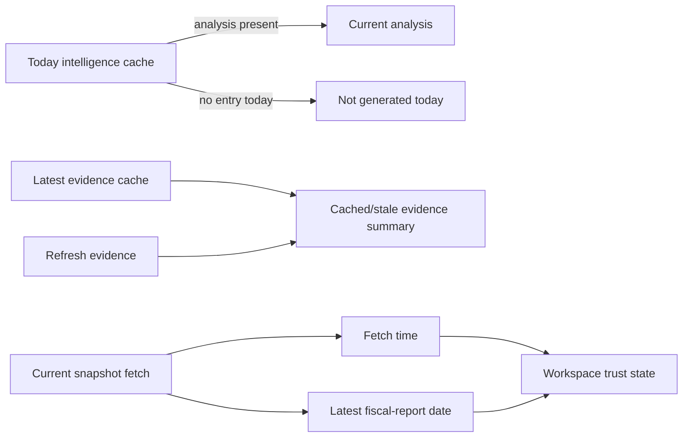

# Workspace Status Truthfulness

**Date:** 2026-07-28  
**Status:** Approved design pending written-spec review  
**Scope:** Follow-up to the symbol workspace redesign; no Backtest changes

## Problem

The workspace currently conflates three materially different states:

- no intelligence analysis has been generated for the current UTC day;
- cached evidence exists from a prior day but has not been refreshed today;
- a fundamentals snapshot was fetched today, but its newest reported fiscal
  quarter is older than the configured reporting-period threshold.

This makes normal cache absence and reporting cadence look like provider
failures or missing data. It also hides useful cached evidence.

## Decisions

1. A `404` from `GET /api/intelligence/{ticker}/latest` that specifically means
   no analysis exists today is an `idle`/`not_generated_today` workspace state,
   not a failed source. The UI presents an explicit Generate analysis action;
   it does not offer a meaningless Retry action or show a red failure banner.
2. The workspace obtains a read-only latest-evidence summary from the existing
   evidence cache. A prior-day cache is shown as cached/stale with its date,
   item count, and an explicit Refresh evidence action. It does not generate
   intelligence or treat old evidence as current.
3. Fundamentals continues to use the server-owned reporting-period freshness
   rule. The UI distinguishes snapshot fetch time from financial-report age:
   “Refreshed today; latest reported quarter is stale” rather than implying
   that the provider fetch failed.
4. Portfolio position/order status retains the existing server-owned ledger
   freshness. The activity detail states the persisted ledger dates and explains
   that a browser refresh rereads the ledger; reconciliation/update is required
   to make it current.

## Data flow

## API and UI boundaries

- Keep `GET /api/intelligence/{ticker}/latest` backward compatible: it may
  still return `404`, but the UI maps the known no-cache error to idle.
- Add a read-only latest-evidence summary endpoint only if the existing API
  cannot expose cache date/count/provider status without collecting sources.
  It must not run collectors, an LLM, or mutate analysis/trading state.
- Keep the existing explicit `POST /api/intelligence/{ticker}/evidence/refresh`
  as the only evidence collection action.
- Preserve snake_case to camelCase transformation at the API boundary.

## Error handling

- Unknown, malformed, or provider-failed intelligence/evidence payloads remain
  partial or failed and retryable where appropriate.
- Only the exact known “no cached analysis today” response maps to idle.
- Cached evidence always includes its source date; it cannot be labelled fresh
  when it predates the current session.

## Tests

- Latest-analysis 404 maps to a neutral not-generated-today UI and exposes
  Generate, not Retry.
- A prior-day evidence cache renders its date/count and Refresh evidence action
  without triggering generation.
- A current fundamentals fetch with a stale reporting quarter renders both
  timestamps and the reporting-period explanation.
- Existing provider/transport errors remain failed/partial rather than being
  remapped to idle.

## Non-goals

- Reusing a previous day's intelligence narrative as current analysis.
- Automatic intelligence generation or evidence collection on selection.
- Changing portfolio reconciliation mechanics, trading workflow, or Backtest.
