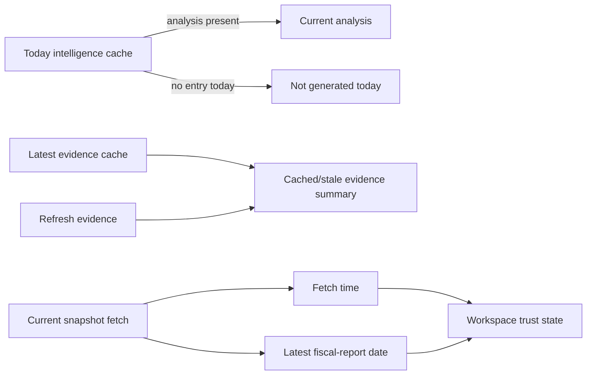

# Workspace Status Truthfulness

**Date:** 2026-07-28  
**Status:** Approved design pending written-spec review  
**Scope:** Follow-up to the symbol workspace redesign; no Backtest changes

## Problem

The workspace currently conflates three materially different states:

- no intelligence analysis has been generated for the current UTC day;
- cached evidence exists from a prior day but has not been refreshed today;
- a fundamentals snapshot was fetched today, but its newest reported fiscal
  quarter is older than the configured reporting-period threshold.

This makes normal cache absence and reporting cadence look like provider
failures or missing data. It also hides useful cached evidence.

## Decisions

1. A `404` from `GET /api/intelligence/{ticker}/latest` that specifically means
   no analysis exists today is an `idle`/`not_generated_today` workspace state,
   not a failed source. The UI presents an explicit Generate analysis action;
   it does not offer a meaningless Retry action or show a red failure banner.
   The API identifies this condition with the stable top-level error code
   `analysis_not_generated_today` while retaining the legacy string `detail`;
   the UI must not infer state from an error-message string.
2. The workspace obtains a read-only latest-evidence summary from the existing
   evidence cache. A prior-day cache is shown as cached/stale with its date,
   item count, and an explicit Refresh evidence action. It does not generate
   intelligence or treat old evidence as current.
   No persisted evidence cache is a neutral `idle`/`not_cached` state with a
   Refresh evidence action, not a provider failure. The API returns an explicit
   evidence freshness status, calculated by the server's configured policy, so
   the browser never derives `fresh`, `cached`, or `stale` from the clock.
   A cache dated on the server's current UTC date is `fresh`; an older cache
   within `intelligence.evidence.cache_stale_after_days` is `cached`; an older
   cache is `stale`.
3. Fundamentals continues to use the server-owned reporting-period freshness
   rule. The UI distinguishes snapshot fetch time from financial-report age:
   “Refreshed today; latest reported quarter is stale” rather than implying
   that the provider fetch failed.
4. Portfolio position/order status retains the existing server-owned ledger
   freshness. The activity detail states the persisted ledger dates and explains
   that a browser refresh rereads the ledger; reconciliation/update is required
   to make it current.

## Data flow

## API and UI boundaries

- Keep `GET /api/intelligence/{ticker}/latest` backward compatible: it may
  still return `404`, with legacy string `detail` plus top-level
  `code = "analysis_not_generated_today"` for the known today-cache miss. The
  UI maps only that code to idle.
- Add a read-only latest-evidence summary endpoint only if the existing API
  cannot expose cache date/count/provider status without collecting sources.
  It must not run collectors, an LLM, or mutate analysis/trading state.
- Keep the existing explicit `POST /api/intelligence/{ticker}/evidence/refresh`
  as the only evidence collection action.
- Preserve snake_case to camelCase transformation at the API boundary.

## Error handling

- Unknown, malformed, or provider-failed intelligence/evidence payloads remain
  partial or failed and retryable where appropriate.
- Only `analysis_not_generated_today` and `evidence_not_cached` map to their
  respective idle states. Unknown or malformed errors, including all other
  404s, remain failed.
- Cached evidence always includes its source date and server-derived freshness
  status. A client may display the supplied status but cannot relabel it from
  its own current date or session age.

## Copy contract

All workspace surfaces use the same localized state intent. The exact wording
can vary by layout, but it must not change the meaning below.

| State | User-facing meaning | Primary action |
| --- | --- | --- |
| `analysis_not_generated_today` | No analysis has been generated today. | Generate analysis |
| `evidence_not_cached` | No saved evidence is available yet. | Refresh evidence |
| `cached` evidence | Saved evidence from `<cached_at>`; it may not reflect later developments. | Refresh evidence |
| `stale` evidence | Saved evidence is older than the configured evidence-freshness window. | Refresh evidence |
| stale reporting period | Snapshot refreshed `<updated_at>`; latest reported quarter is `<most_recent_quarter>`, which is older than the reporting-period threshold. | Refresh fundamentals |
| provider or transport failure | `<source>` could not be loaded; existing validated content, if any, remains visible. | Retry |
| refresh with prior content | Refreshing; showing the last validated data from `<timestamp>`. | None while active |

The header, source-status detail, Fundamentals tab, and Intelligence tab must
consume these i18n keys rather than create separate interpretations of
“missing,” “stale,” or “failed.”

## Tests

- Latest-analysis 404 maps to a neutral not-generated-today UI and exposes
  Generate, not Retry.
- Latest-analysis mapping uses the stable error code; nonmatching 404 and
  all 5xx responses remain failed and retryable.
- No evidence-cache 404 maps to neutral not-cached UI with Refresh evidence,
  not Retry.
- A prior-day evidence cache renders its server-provided status, date/count,
  and Refresh evidence action without triggering generation.
- A current fundamentals fetch with a stale reporting quarter renders both
  timestamps and the reporting-period explanation.
- The generic HTTP error parser preserves structured details, string details,
  non-JSON failures, and status for the state mapper.

## Non-goals

- Reusing a previous day's intelligence narrative as current analysis.
- Automatic intelligence generation or evidence collection on selection.
- Changing portfolio reconciliation mechanics, trading workflow, or Backtest.
