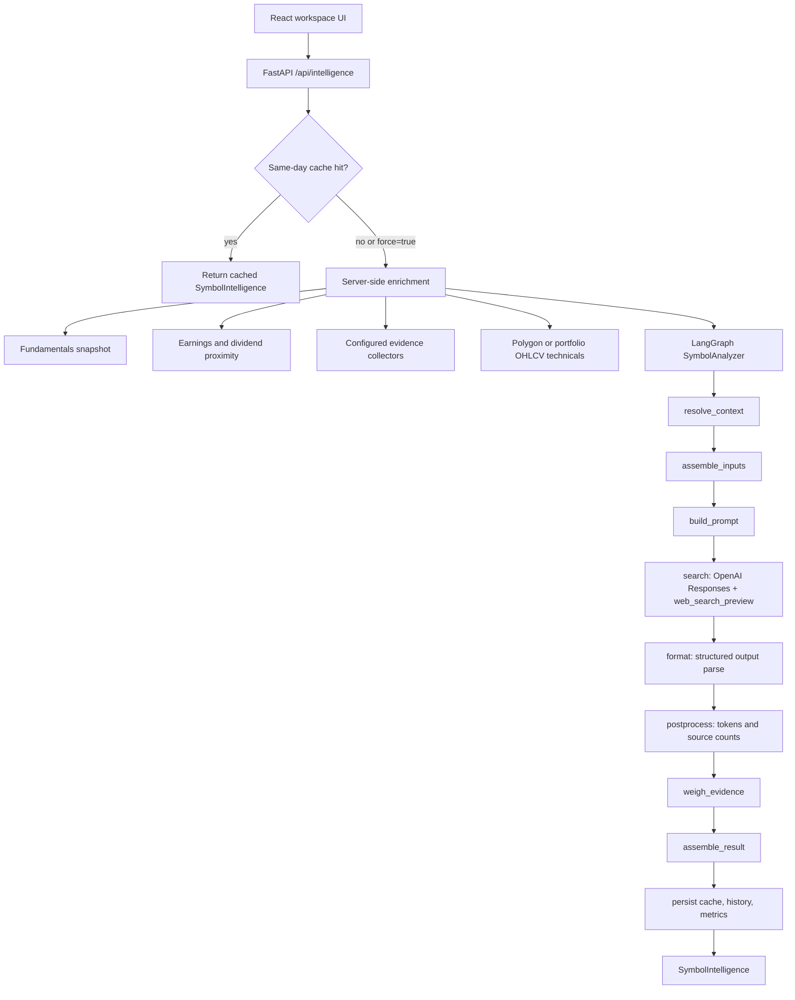
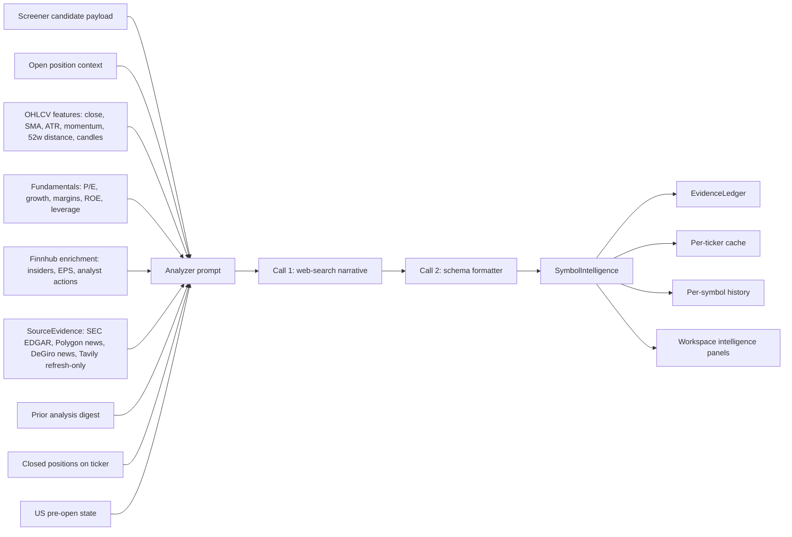
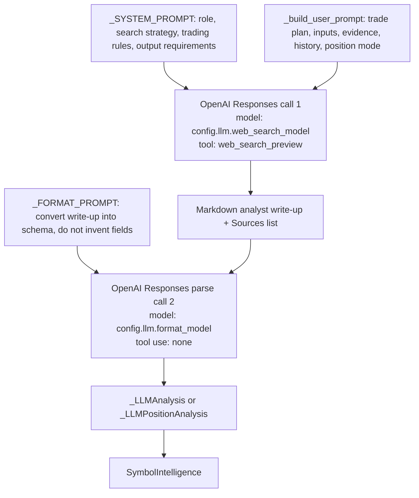

# Intelligence Module

Post-close LLM enrichment for screener candidates and open positions.

## Purpose

Given a ticker, builds a structured context snapshot (OHLCV features, fundamentals, Finnhub signals) and sends it to an LLM for swing-trading analysis. Output is a `SymbolIntelligence` result with narrative, action recommendation, catalyst context, classified cited catalysts, and an advisory evidence ledger. Results are cached per ticker (TTL-based, stored in `data/intelligence/`).

## Files

| File | Purpose |
|------|---------|
| `symbol_analyzer.py` | Entry point. Assembles context → two-call LLM flow → parses `SymbolIntelligence`. |
| `models.py` | `SymbolIntelligence`, `SymbolIntelligenceRequest` data contracts. |
| `cache.py` | Per-ticker JSON cache (today's latest). Reads/writes to `data/intelligence/`. |
| `history.py` | Durable per-symbol analysis history (newest-first, capped). Feeds the thesis-drift digest + UI timeline. |
| `market_hours.py` | Minimal zoneinfo US market-hours helper. Decides pre-open mode + previous session close. |
| `metrics.py` | Append-only per-analysis metrics log (`data/intelligence/intelligence_metrics.json`). |
| `tracing.py` | Per-run trace recording and durable persistence (pydantic models, `TraceRecorder`, disk I/O with per-ticker index). |
| `graph/` | LangGraph state graph for `SymbolAnalyzer.analyze()` (`resolve_context` → `assemble_inputs` → `build_prompt` → `search` → `format` → `postprocess` → `weigh_evidence` → `assemble_result` → `persist`). |
| `weighting/` | Deterministic advisory evidence weighting (`EvidenceLedger`, `WeightedSignal`, `weigh(...)`, YAML-backed config). |

## API Surface

```
POST /api/intelligence/{ticker}            — run analysis; cache result
GET  /api/intelligence/{ticker}/evidence/latest — newest persisted evidence-cache metadata; no collection or LLM
POST /api/intelligence/{ticker}/evidence/refresh — refresh evidence only; no LLM or trading mutation
GET  /api/intelligence/{ticker}/latest     — return most-recent cached result
GET  /api/intelligence/{ticker}/history    — return per-symbol analysis history (newest-first, capped)
GET  /api/intelligence/runs/{run_id}       — return a single persisted agent-run trace
GET  /api/intelligence/{ticker}/runs       — per-symbol run-trace index (newest-first, capped)
POST /api/intelligence/sweep               — batch run across watchlist + open positions
```

Router: `api/routers/intelligence.py`
Services: `api/services/intelligence_enrichment.py`,
`api/services/intelligence_chat_service.py`,
`api/services/position_review_service.py`, and
`api/services/strategic_review_service.py`
Core: `symbol_analyzer.py`

## Flow at a glance

The current single-symbol analyzer is a linear LangGraph wrapped by the FastAPI
intelligence endpoints. Cache checks and server-side enrichment happen before
the graph; cache/history/metrics writes happen inside the final `persist` node.



## Data and source map

The LLM sees an assembled prompt, not raw application state. The deterministic
enrichment layer decides which app fields, market data, evidence items, and
history entries are present before the OpenAI calls run.



## Prompt and model flow

The analyzer deliberately splits research from schema extraction. Call 1 can use
web search and write prose with citations; call 2 is tool-free and converts that
prose into the validated pydantic schema.



## Input Context

The analyzer assembles context from:
- OHLCV features (Close, ATR%, SMA trend, momentum, 52w high proximity)
- Fundamentals snapshot (P/E, revenue growth, gross margin, balance sheet signals)
- Finnhub signals (insider transactions, forward EPS estimate, upgrade/downgrade actions)
- Open position details (if ticker is already held — switches action to `MANAGE_ONLY`)
- Recent candlestick patterns via `SymbolIntelligenceRequest.recent_patterns`
  (list of `"name@context"` strings). When present they render a
  "Recent candlestick patterns" line in the prompt; the field is optional and the
  caller (e.g. the web UI request builder) populates it from detected patterns.

### Server-side auto-fetch (full data, blocking)

`POST /api/intelligence/{ticker}` runs `enrich_intelligence_request`
(`api/services/intelligence_enrichment.py`) before the LLM call. Any request field
left unset is filled server-side (blocking) from the fundamentals snapshot
(`FundamentalsService.get_snapshot`) and earnings proximity — so the model always
sees the full picture regardless of what the caller sent. Provider errors degrade
gracefully (the field stays unset; analysis never fails on a fetch error), and
caller-provided values are never overwritten.

Every attempted fundamentals, earnings, dividend, evidence, technical, and
Polygon-price source appends an `EnrichmentDiagnostic` to the request. The graph
copies these entries to `SymbolIntelligence.inputs_used.enrichment_diagnostics`
with a `used`, `missing`, or `failed` status plus optional as-of time and item
count. Failure messages are stable, user-safe summaries; detailed provider
exceptions remain restricted to logs and run traces. The field is additive, so
cached results written before diagnostics were introduced remain valid.

`POST /api/intelligence/{ticker}/evidence/refresh` is the explicit evidence-only
path used by the workspace input review. It bypasses the analyzer entirely,
forces the configured evidence collectors (including refresh-only collectors),
updates their normal curated evidence cache, and returns only a sanitized
per-provider manifest with freshness, count, and failure status. It never writes
analysis/history/metrics, calls an LLM, or mutates portfolio/order state. Raw
collector exceptions remain server-side.

`GET /api/intelligence/{ticker}/evidence/latest` scans the persisted evidence
cache newest-first and returns only sanitized cache metadata (date, item count,
and publishers). It is used to disclose prior-day evidence in the workspace;
it never calls collectors or the analyzer.

`POST /api/intelligence/position/{position_id}` enriches the same way: it runs
`enrich_intelligence_request` (fundamentals + earnings) and then `enrich_with_technicals`,
which fetches recent OHLCV via `PortfolioService.fetch_recent_ohlcv` and computes SMAs,
6m/12m momentum, ATR, 52-week-high distance and candle patterns for the held symbol. This
is why open positions get the same `--- Technical context ---`, `--- Fundamentals ---`,
`--- Chart quality ---` and `--- Finnhub enrichment signals ---` blocks a candidate gets,
instead of only entry/stop. Benchmark-relative fields (`rel_strength`, `sector_rs`) are not
filled on this single-symbol path. The screener decision-context block stays candidate-only.

The prompt now renders a `--- Fundamentals ---` block from the raw-fundamentals
fields on `SymbolIntelligenceRequest`: `trailing_pe`, `revenue_growth_yoy`,
`gross_margin`, `net_margin`, `return_on_equity`, `debt_to_equity` (alongside the
existing Finnhub signal fields). The web-search instruction is multi-hop — search
broadly, follow the material leads, then run a dedicated forward-looking catalyst
pass — and every news claim must cite its source URL.

`SymbolAnalyzer.analyze()` compiles and invokes the LangGraph state graph in
`intelligence/graph/`. The graph is intentionally linear today so each former
pipeline step is explicit and independently testable. The graph output remains a
single `SymbolIntelligence` object; persistence side effects still happen after
result assembly.

## Evidence Ledger

The `intelligence/weighting/` package computes a pure, deterministic
`EvidenceLedger` from the LLM draft plus request inputs. It emits itemized
`WeightedSignal` rows, aggregate bull/bear weights, a net value, and a qualitative
`balance_label` (`strongly_bullish`, `bullish`, `mixed`, `bearish`,
`strongly_bearish`).

Important constraints:

- The ledger is advisory only. It never mutates `action` or `conviction`.
- It is not a 0–100 score and should not be presented as predictive precision.
- Unknown signal/catalyst keys default to weight `0`.
- Weights and thresholds live under `config.evidence_weights` in
  `config/intelligence.yaml`.

## Strategic overlay

The `intelligence/strategic/` package is an isolated advisory layer above
single-symbol analysis. It does not crawl, trade, mutate symbol convictions, or
change portfolio state. Its first input seam is cached `SymbolIntelligence`:
`signal_adapter.py` converts existing symbol analysis into app-context signals
and watched-symbol context, then `StrategicIntelligenceAgent.analyze()` builds a
portfolio/watchlist overlay report.

The API seam is `POST /api/intelligence/strategic-review`. It is manual-only:
the caller supplies a ticker/topic/risk mode and may explicitly request
`refresh_sources=true`. Refreshed evidence is limited to configured app evidence
collectors and is counted in `external_source_count`; otherwise the report is
built from cached app context.

Use this layer for questions such as: "Does a broader situation change how I
should interpret these candidates, watchlist names, or open positions?" The
output is deliberately constrained to review actions such as
`WAIT_FOR_CONFIRMATION`, `REVIEW_CONTEXT`, and risk-review prompts. Execution
actions like `BUY_NOW` are not part of the strategic action schema.

`SymbolIntelligence` exposes:

- `evidence_ledger: EvidenceLedger | None`
- `classified_catalysts: list[ClassifiedCatalyst]`

`classified_catalysts` are already-happened, source-cited catalysts from the LLM
format pass. Forward-looking events stay in `upcoming_events`.

### Calibration helper

Use the offline exporter to review cached ledger labels before tuning weights:

```bash
.venv/bin/python scripts/export_evidence_ledger_calibration.py --format markdown --limit 20
.venv/bin/python scripts/export_evidence_ledger_calibration.py --format csv --output /tmp/evidence-ledger-calibration.csv
```

The exporter reads `data/intelligence/sweep_*.json`, skips entries without an
`evidence_ledger`, and adds blank `human_read` / `notes` columns for manual
review. After reviewing clear bullish, bearish, mixed, and sparse-data examples,
tune only `config.evidence_weights` in `config/intelligence.yaml`.

## Pre-open gap outlook

When analysis runs for a **US symbol** (`currency == "USD"`) during the US
pre-market window (ET, weekday, before the 09:30 open — see `market_hours.py`),
the analyzer enters pre-open mode and asks the model for a `pre_open_outlook`:
`gap_direction` (gap_up/gap_down/flat), `magnitude` bucket (minor/moderate/large —
never a fake %), `primary_driver` (the overnight item most likely to move the
open, source-cited), `action_at_open`, `stop_gap_plan` (what to do if it gaps
through the stop), and `confidence`. Sourcing is web-search only (index/sector
futures + the stock's pre-market print + overnight headlines since the previous
session close). Outside the window, or for non-US symbols, the field is `None`
and behavior is unchanged. Applies to held positions (framed on the real stop)
and screener candidates (framed on the planned entry/stop).

## Analysis memory (thesis drift)

Every successful analysis appends a compact entry to
`data/intelligence/history/{TICKER}.json` (newest-first, capped at
`analysis_history.max_entries`, default 50). Before each run the analyzer reads
the last `analysis_history.digest_size` entries (default 5) and feeds them into
the prompt as a `--- Prior analyses (most recent first) ---` digest. The model
returns a `thesis_delta` (`status`: new/confirmed/weakening/invalidated,
`summary`, `what_played_out`) comparing today's read to the prior ones. The full
history is exposed via `GET /api/intelligence/{ticker}/history` for the UI timeline.
When a follow-up analysis is appended, prior history predictions are annotated
with an optional deterministic `outcome` (`confirmed`, `contradicted`, or
`unresolved`) by matching `thesis_delta.what_played_out` against each prior
prediction's reason/reference. This is an audit aid only; it is not a return
prediction or model-scoring loop.

## Two-call analyzer

The symbol analyzer runs two sequential LLM calls to keep web-search from truncating structured output mid-JSON:

1. **Call 1 (search)** — `config.llm.web_search_model` (default `gpt-4o`) performs the multi-hop web search, writes a prose narrative with cited source URLs, and returns free-text.
2. **Call 2 (format)** — `config.llm.format_model` (default `gpt-4o-mini`) receives the prose and structures it into the validated `SymbolIntelligence` schema via the Responses structured-output API (`responses.parse`). No tool use in call 2.

The split preserves full reasoning in call 1 while using a cheaper model for deterministic schema extraction in call 2. Structured evidence is injected at the `--- Catalyst evidence ---` seam before the narrative call.

## Configuration

`config/intelligence.yaml` — LLM provider (OpenAI), model, temperature, signal type toggles,
plus `analysis_history` (history cap + digest size) and `pre_open` (timezone + session bounds).

Key LLM settings:

| Key | Default | Purpose |
|-----|---------|---------|
| `llm.web_search_model` | `gpt-4o` | Call 1: web search + narrative |
| `llm.format_model` | `gpt-4o-mini` | Call 2: tool-free structured output |
| `llm.web_search_max_tokens` | `4000` | Token budget for call 1 |
| `llm.request_timeout_seconds` | `60` | Per-call HTTP timeout |
| `llm.max_retries` | `2` | Retry count for transient errors |
| `llm.analyzer_enabled` | `true` | Kill-switch: `false` → endpoints return 503 |

API keys go in environment variables, not the config file.

## Caching

Results stored as JSON under `data/intelligence/<ticker>_analysis.json`. TTL is set in `config/intelligence.yaml`. `cache.py` exposes `get_cached_analysis(ticker)` → returns `None` on miss or expiry.

`POST /api/intelligence/{ticker}` checks the cache first and returns the same-day result unless `force=true` is passed. `/sweep` applies the same cache-before-spend logic per symbol.

## Observability

The module exposes result-level observability today. A successful analysis
contains the data categories used, cited sources, advisory ledger output, and
history metadata; metrics add a capped token log for quick operational checks.

```mermaid
flowchart LR
  Result[SymbolIntelligence] --> Inputs[inputs_used: trade plan, technicals, provenance, enrichment diagnostics]
  Result --> Sources[sources: URLs cited by the model]
  Result --> Catalysts[classified_catalysts: typed cited catalysts]
  Result --> Ledger[evidence_ledger: deterministic bull/bear balance]
  Result --> Timeline[history/{TICKER}.json: thesis drift timeline]
  Result --> Chat[chat/{TICKER}/{date}.json: follow-up Q&A]
  Persist[persist node] --> Metrics[intelligence_metrics.json: ts, ticker, tokens]
```

`data/intelligence/intelligence_metrics.json` is an append-only log (capped at
500 entries) written by `metrics.py` after each analysis. Each entry is
`{ts, ticker, tokens}`. A sudden `tokens: null` run pinpoints a call that did
not complete; source coverage is visible through `inputs_used.sources` on the
cached result and the per-date evidence cache.

### Per-run trace

Every graph run (and its pre-graph enrichment) is recorded to a durable trace via
`tracing.py`. The API endpoint owns the recorder lifecycle through the
`recording_run(ticker)` context manager (create → capture any error → always
finalize); it records each enrichment step (`enrich_request`, `enrich_technicals`,
`enrich_polygon`) and passes the recorder into `SymbolAnalyzer.analyze(..., recorder=...)`;
a wrapper in `graph/build.py` records each graph node (nodes stay pure). Traces are
written to `data/intelligence/runs/{run_id}.json` with a per-ticker index at
`data/intelligence/runs/index/{TICKER}.json` (newest-first, capped at
`config.tracing.max_runs_per_ticker`). The index is updated under an exclusive file
lock so concurrent same-ticker runs cannot clobber each other, and the run just
written is never pruned from its own index. Single-symbol generation may include
a client attempt ID; the trace and index persist that ID and the requested force
mode so clients can resolve an exact concurrent or failed attempt. These fields
are additive and absent from older run files. Each `SymbolIntelligence` result (and its
cache entry) carries the `run_id` that produced it, so a cache hit still resolves
its trace. Each step records status, timing, and an `outputs_summary`; steps that
have them also record model, token usage, `source_counts`, `prompt_hash` + a
truncated `prompt_preview` (no full prompt), and any error. `source_counts` is the
per-host tally of the web-search citations the run actually used (`result.sources`),
not catalyst-evidence publishers. The enrichment steps record a compact
`outputs_summary` (e.g. resolved `close`, fetched OHLCV rows) rather than timing
alone, and the UI renders a detail tab only when its field is present.
Tracing is fail-soft and controlled by `config.tracing.enabled` (default `true`).

Endpoints: `GET /api/intelligence/runs/{run_id}`, `GET /api/intelligence/{ticker}/runs`.

## Action Types

`SymbolIntelligence.action` is one of:
- `BUY_NOW` — entry signal active at current price
- `BUY_ON_PULLBACK` — waiting for price to pull back to planned entry level
- `WAIT_FOR_BREAKOUT` — waiting for confirmation above a breakout level
- `WATCH` — worth monitoring, but not actionable yet
- `TACTICAL_ONLY` — short-term or event-specific setup only
- `AVOID` — no acceptable setup under the current evidence
- `MANAGE_ONLY` — position already held; narrative is position-management focused

## Evidence Collectors

`intelligence/evidence/` gathers structured catalyst evidence from real sources before the LLM call.

### Module layout

| Path | Purpose |
|------|---------|
| `evidence/models.py` | `SourceEvidence` (pydantic) — `title, url, publisher, published_at, quote_or_summary, relevance` |
| `evidence/config.py` | `EvidenceConfig` + `load_evidence_config()` — reads `config.evidence` from the intelligence document |
| `evidence/curation.py` | `curate(items, *, window_days, max_items, asof_date)` — recency-window filter + dedup (normalized title+url) + newest-first + cap |
| `evidence/registry.py` | `CatalystCollector` protocol + `@register` decorator + `get_registered()` collector map |
| `evidence/collect.py` | `collect_evidence(ticker, *, asof_date, cfg, cache_root, refresh_sources)` — per-date cache, fan-out across registered enabled collectors (fail-soft), curate |
| `evidence/collectors/sec_edgar.py` | `SecEdgarCatalystCollector` — SEC EDGAR submissions API (`data.sec.gov/submissions/CIK…json`), material-event filings (8-K, 6-K, SC 13D/G, 424B, DEF 14A) |
| `evidence/collectors/polygon_news.py` | `PolygonNewsCollector` — Polygon.io ticker news (`/v2/reference/news`) with per-symbol sentiment; key-gated, on-demand (one HTTP call per `collect`) |
| `evidence/collectors/tavily_news.py` | `TavilyNewsCollector` — optional refresh-only search datasource for move explanations, news, and macro/geopolitical risk |

### Collectors

`SecEdgarCatalystCollector` and `PolygonNewsCollector` implement the `DiagnosableSource` protocol (`describe()` + `probe(canary)`). Registered in `_PROBEABLE` in `api/services/datasources_service.py` as `sec_edgar_catalysts` and `polygon_news`.

- **`sec_edgar_catalysts`** (`SecEdgarCatalystCollector`): reads the SEC EDGAR submissions API (ticker→CIK via `company_tickers.json`, then `submissions/CIK…json`) and keeps recent material-event filings for US tickers. Forms are matched by prefix (`config.evidence.sec_forms`, default `8-K, 6-K, SC 13D, SC 13G, 424B, DEF 14A`, so `424B` catches `424B5` and `SC 13D` catches `SC 13D/A`), and each item carries a per-form relevance label. The HTTP User-Agent declares a contact email (`config.evidence.http.user_agent`) as required by SEC EDGAR fair-use policy. Fail-soft — returns empty on HTTP errors and records a fallback event.
- **`polygon_news`** (`PolygonNewsCollector`): reads Polygon.io's `/v2/reference/news` for one ticker, filtered to `config.evidence.recency_window_days` and capped at `max_items_per_symbol`. Each article maps to a `SourceEvidence` with the per-symbol `insights.sentiment` rolled into the relevance label (`positive→bullish`, `negative→bearish`). Requires `POLYGON_IO_API_KEY`; without it the collector returns an empty list (no error). Enabled by default via `config.evidence.enabled_sources`; one HTTP call per ticker keeps API-credit usage bounded for on-demand use.
- **`tavily_news`** (`TavilyNewsCollector`): searches recent symbol news, move explanations, and macro/geopolitical risk. Requires `TAVILY_API_KEY`; without it the collector returns an empty list. It is marked `REFRESH_ONLY`, so `collect_evidence(..., refresh_sources=False)` skips it even when configured. Chat follow-ups and manual position reviews pass `refresh_sources=True` only when the user explicitly requests fresh app sources.

The `company_ir_rss` collector (IR RSS feed auto-discovery) and the `exchange_announcements` collector (EU venue-wide RSS) were removed: IR feeds were unreliable and symbol-IR coverage was incomplete; exchange-wide notices are not symbol-specific and add no signal beyond the web-search pass.

### Curation defaults

Controlled by `config.evidence` in `config/intelligence.yaml`:
- `recency_window_days: 30` — discard items older than 30 days
- `max_items_per_symbol: 8` — keep the 8 most-recent items after dedup

### Cache

Curated evidence is cached lazily at `data/intelligence/evidence/{date}/{ticker}.json` (regenerable; not committed). No schema migration required.

`GET /api/intelligence/{ticker}/evidence/latest` reads only the newest valid
cache metadata; it never collects sources or invokes an LLM. Its
`freshness_status` is server-owned: same-day evidence is `fresh`, evidence no
older than `config.evidence.cache_stale_after_days` is `cached`, and older
evidence is `stale`. A missing cache is the neutral `evidence_not_cached`
condition, not a provider failure.

### Prompt injection

`collect.py` is called during `enrich_intelligence_request` and the curated items are passed into the LLM prompt as a `--- Catalyst evidence ---` block.

To add a deterministic collector:

1. Implement a class with `SOURCE_ID` and classmethod `collect(ticker, *, asof_date, cfg)`.
2. Decorate it with `@register` from `intelligence.evidence.registry`.
3. Import the module from `evidence/collect.py` so registration runs.
4. Add the `SOURCE_ID` to `config.evidence.enabled_sources`.

Data Sources diagnostics remain separate: probeable collectors are still exposed
through `api/services/datasources_service.py`.

### Fail-soft behavior

Each collector catches all HTTP/parse errors, calls `record_fallback(...)`, and returns an empty list. The enrichment pipeline never raises on a collector failure.

## Open-position fields

When the request carries position context (`entry_price`, `entry_date`, `r_now`, `days_open`), the
result also populates:
- `position_signal` — HOLD / TRIM / EXIT call
- `position_outlook` — forward holding plan (expected hold, thesis status, invalidation signals, …)
- `position_move_explanation` — backward look: why price moved from entry to now (`direction`
  up/down/flat, `summary`, and `drivers[]` of `{label, detail}` grounded in news since the entry
  date), explaining the sign and size of the current R. `null` outside position context.

In position context the structured-output parser (call 2) uses `_LLMPositionAnalysis`, a variant that
makes `position_signal`, `position_outlook` and `key_numbers` **required** so the model cannot omit
them. As a belt-and-suspenders backstop, if `position_signal` or `key_numbers` still come back empty
they are filled deterministically by `_fallback_position_fields(req)` from request data only
(`signal` → HOLD/EXIT, plus current R / days held / entry / stop) — no LLM, no I/O. `position_outlook`
has no deterministic fallback (it cannot be synthesised from request numbers) and relies on the
required-field enforcement. The candidate (non-position) path is unaffected: it still parses
`_LLMAnalysis`, where these fields stay optional.

## Distilled fields and UI panels

The narrative is the long-form reasoning; the web UI keeps it collapsed and leads with distilled,
structured fields the call-2 formatter extracts from the prose. The card renders a **fixed,
status-aware panel skeleton** so the layout does not silently vary with which fields the model filled:

- **Screened candidate**: Decision focus (`summary_line` + `price_hook` "why now") · Key numbers
  (`key_numbers`) · What to expect (`prediction_bullets` + `upcoming_events`) · News (`news`) · Risks
  (`risk_factors`) · Full rationale (collapsed).
- **Open position** (action `MANAGE_ONLY`): Decision focus + Position signal (`position_signal`) · Why
  it moved (`position_move_explanation`) · Outlook (`position_outlook`) · Key numbers · What to expect ·
  News · Full rationale (collapsed).

`news` is a list of `NewsItem` (`{headline, url, date, sentiment}`) — recent, already-happened items
the model surfaced in search, distinct from `upcoming_events` (forward-looking). Additive and
backward-compatible: results from before this field default to `[]`. The prompt is responsible for
filling each panel for the active status; a genuinely empty panel renders a muted placeholder rather
than disappearing.

## DeGiro agenda signals — availability note

The `degiro-connector` library exposes an `AgendaRequest` API that supports:

| CalendarType | Fields | Status |
|---|---|---|
| `EarningsCalendar` | date, company, isin | **Not implemented** — `days_to_earnings` is populated from Finnhub (US-only); EU tickers get `None`. DeGiro's earnings calendar (ISIN-filterable) is the natural fix. |
| `DividendCalendar` | exDate, dividendAmount, currency, isin | Implemented in `api/services/portfolio/degiro_dividend.py` (`feat/degiro-dividend-calendar`). |

To implement earnings calendar enrichment: create `DegiroEarningsEnricher` mirroring `degiro_dividend.py`, call `api.get_agenda(AgendaRequest(calendarType=CalendarType.EARNINGS_CALENDAR, isin=isin, ...))`, and wire the result into `enrich_intelligence_request()` alongside the Finnhub path.
